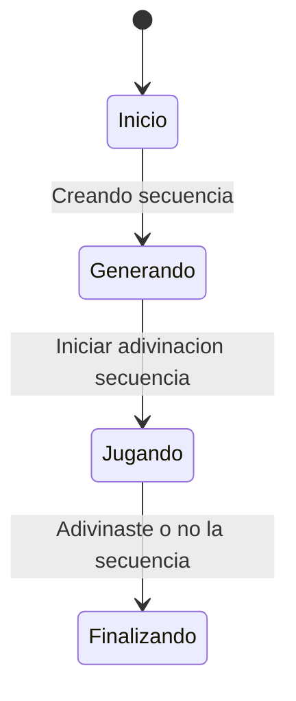

# Simon Dice

Esta es una versión del juego Simon Dice, para Android, el juego consiste en que tenemos una secuencia, de colores que nosotros tenemos que repetir


Como se puede ver aqui el juego es bastante sencillo en mi caso puse un estado finalizando y no uno perdiendo
este estado es bastante general ya que por lo general no se suele relacionar con perder directamente pero bueno, estoy pensando en si deberia añadir un perdiendo

## Arquitectura

El proyecto sigue una arquitectura MVVM (Modelo-Vista-VistaModelo), separando la lógica de la interfaz de usuario.

- **Modelo**: Representado por `Datos.kt`, que contiene los datos del juego, como las secuencias y los colores.

- **Vista**: La interfaz de usuario, construida con Jetpack Compose en `IU.kt`. Reacciona a los cambios en el `ModeloVista` y envía las interacciones del usuario.

- **ModeloVista**: `ModeloVista.kt` actúa como el ViewModel, conteniendo la lógica del juego, gestionando el estado y exponiendo los datos a la Vista a través de `StateFlow`.

## Decisiones de Diseño Clave

- **Jetpack Compose**: Para una interfaz de usuario declarativa y moderna.
- **StateFlow**: Para una comunicación reactiva y eficiente entre el `ModeloVista` y la Vista.
- **Clases Selladas**: En `Estados.kt`, para gestionar de forma segura y clara los diferentes estados del juego.

## Build y Ejecución

Para compilar y ejecutar la aplicación, clona el repositorio y abre el proyecto en Android Studio. El proyecto utiliza Gradle, por lo que las dependencias se descargarán automáticamente. A continuación, puedes ejecutar la aplicación en un emulador o en un dispositivo físico.

Para compilar el proyecto desde la línea de comandos, utiliza el siguiente comando:

```bash
./gradlew build
```

## Muestra de como es en ejecucion

