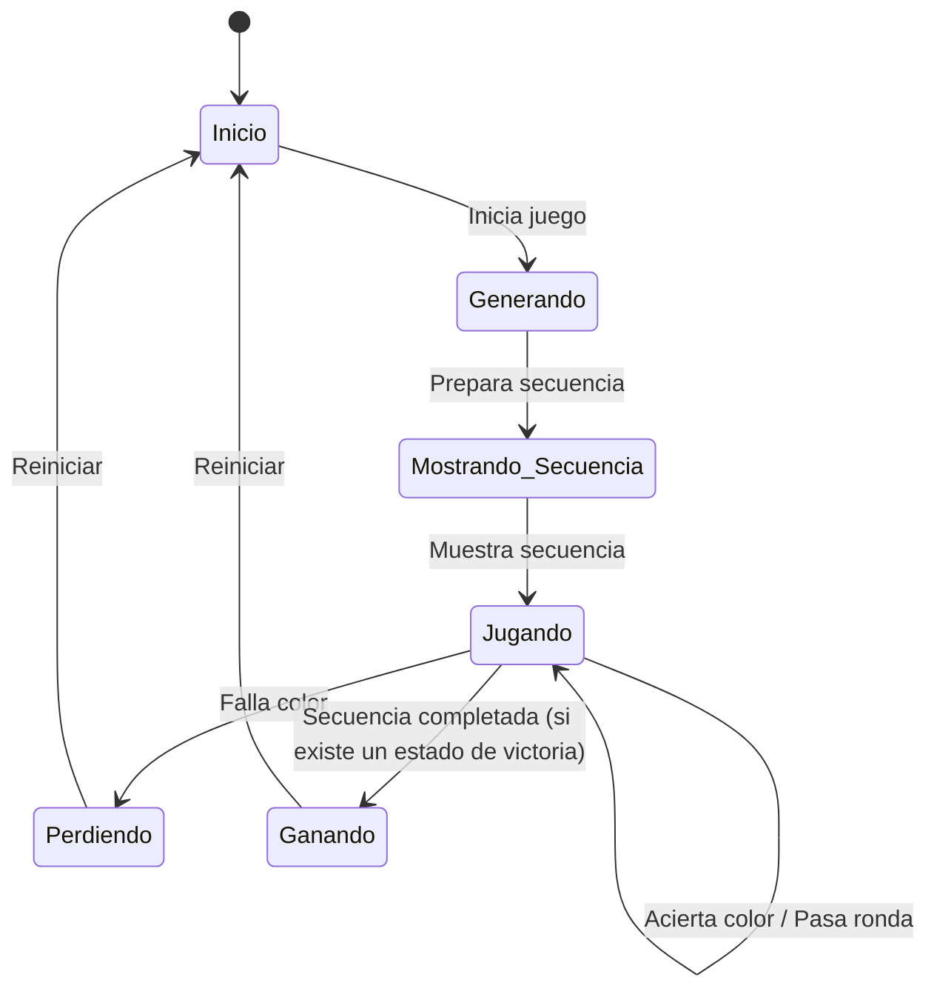

#  Simon Dice 🧠

¡Bienvenido a Simon Dice, una versión moderna y vibrante del clásico juego de memoria para Android! 🎮

## 📝 Descripción

Este proyecto es una implementación del juego Simon Dice, donde los jugadores deben repetir secuencias de colores que se van volviendo cada vez más largas y complejas. Es un excelente ejercicio para la memoria y la concentración, ¡y muy divertido! 🥳

## 📊 Diagrama de Estados del Juego



## 🚀 Características

*   **Juego Clásico**: La experiencia de juego que ya conoces y amas.
*   **Interfaz Moderna**: Construida con Jetpack Compose para una experiencia de usuario fluida y atractiva.
*   **Sonidos Envolventes**: Efectos de sonido que te sumergirán en el juego.
*   **Puntuación Más Alta**: ¡Compite contigo mismo para superar tu récord! 🏆

## 🏛️ Arquitectura

El proyecto sigue la arquitectura **MVVM (Modelo-Vista-VistaModelo)**, lo que garantiza una separación clara entre la lógica de negocio y la interfaz de usuario.

*   **Modelo**: Representado por `Datos.kt`, contiene toda la lógica de negocio y los datos del juego, como las secuencias, los colores y la puntuación.
*   **Vista**: La interfaz de usuario, construida con **Jetpack Compose** en `IU.kt`. Se encarga de mostrar los datos del juego y de notificar al `ModeloVista` sobre las interacciones del usuario.
*   **ModeloVista**: `ModeloVista.kt` actúa como el intermediario entre el Modelo y la Vista. Contiene la lógica de presentación, gestiona el estado del juego y expone los datos a la Vista a través de `StateFlow`.

## 🎨 Decisiones de Diseño Clave

*   **Jetpack Compose**: Se eligió para crear una interfaz de usuario declarativa, moderna y fácil de mantener.
*   **StateFlow**: Para una comunicación reactiva y eficiente entre el `ModeloVista` y la Vista, asegurando que la interfaz de usuario siempre refleje el estado actual del juego.
*   **Clases Selladas**: En `Estados.kt`, se utilizan para gestionar de forma segura y clara los diferentes estados del juego (Inicio, Generando, Mostrando_Secuencia, Jugando, Perdiendo, Ganando), evitando errores y haciendo el código más robusto.
*   **SharedPreferences**: Se utiliza para persistir la puntuación más alta de forma asíncrona y eficiente.

## 🛠️ Tecnologías Utilizadas

*   **Kotlin**: Lenguaje de programación principal.
*   **Jetpack Compose**: Para la interfaz de usuario.
*   **StateFlow**: Para la gestión de estados.
*   **SharedPreferences**: Para el almacenamiento de datos.
*   **Material 3**: Para los componentes de la interfaz de usuario.
*   **Mockk**: Para la creación de mocks en las pruebas unitarias.

## 📦 Build y Ejecución

Para compilar y ejecutar la aplicación, sigue estos pasos:

1.  **Clona el repositorio**:
    ```bash
    git clone https://github.com/tu_usuario/SimonDice.git
    ```
2.  **Abre el proyecto en Android Studio**:
    *   Ve a `File` > `Open` y selecciona el directorio del proyecto.
3.  **Ejecuta la aplicación**:
    *   Selecciona un emulador o un dispositivo físico y haz clic en el botón `Run`.

También puedes compilar el proyecto desde la línea de comandos:

```bash
./gradlew build
```

## 🎮 Cómo Jugar

1.  **Inicia el juego**: Presiona el botón de `Jugar`.
2.  **Observa la secuencia**: El juego te mostrará una secuencia de colores.
3.  **Repite la secuencia**: Toca los colores en el mismo orden en que se mostraron.
4.  **¡Supera tu récord!**: Si aciertas, la secuencia se hará más larga. ¡Intenta llegar lo más lejos posible!

## 🖼️ Muestra de como es en ejecución


## 👨‍💻 Sobre el Autor

¡Hola! Soy [Oscar], un apasionado desarrollador de Android. ¡Espero que disfrutes de este juego!

*   **GitHub**: [@Mestosc](https://github.com/Mestosc)

¡Gracias por jugar! 😊