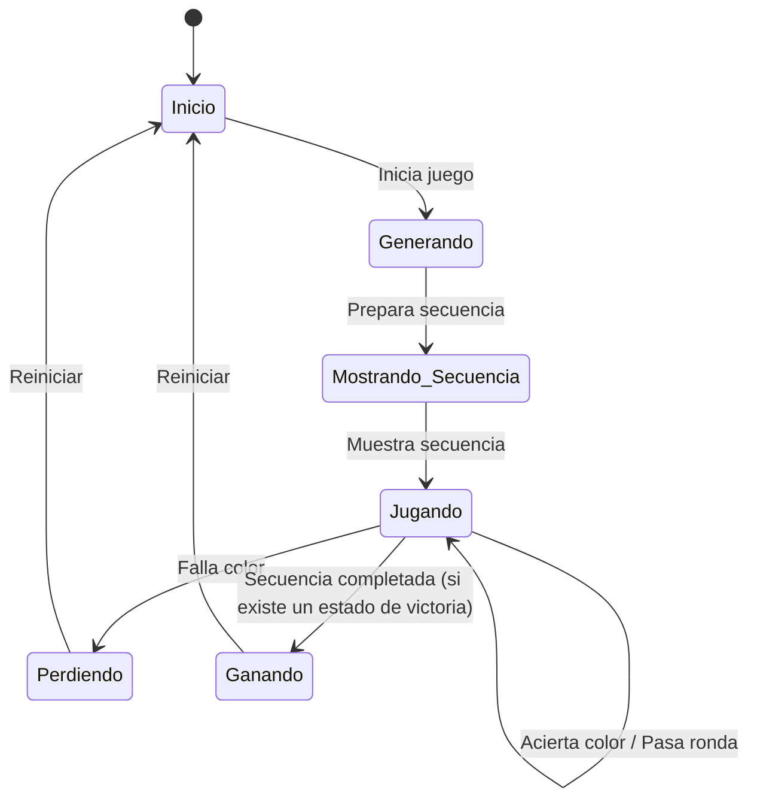

#  Simon Dice 🧠

¡Bienvenido a Simon Dice, una versión moderna y vibrante del clásico juego de memoria para Android! 🎮

## 📝 Descripción

Este proyecto es una implementación del juego Simon Dice, donde los jugadores deben repetir secuencias de colores que se van volviendo cada vez más largas y complejas. Es un excelente ejercicio para la memoria y la concentración, ¡y muy divertido! 🥳

## 📊 Diagrama de Estados del Juego



## 🚀 Características

*   **Juego Clásico**: La experiencia de juego que ya conoces y amas.
*   **Interfaz Moderna**: Construida con Jetpack Compose para una experiencia de usuario fluida y atractiva.
*   **Sonidos Envolventes**: Efectos de sonido que te sumergirán en el juego.
*   **Puntuación Más Alta**: ¡Compite contigo mismo para superar tu récord! 🏆

## 🏛️ Arquitectura

El proyecto sigue la arquitectura **MVVM (Modelo-Vista-VistaModelo)**, lo que garantiza una separación clara entre la lógica de negocio y la interfaz de usuario.

*   **Modelo**: Representado por `Datos.kt`, contiene toda la lógica de negocio y los datos del juego, como las secuencias, los colores y la puntuación.
*   **Vista**: La interfaz de usuario, construida con **Jetpack Compose** en `IU.kt`. Se encarga de mostrar los datos del juego y de notificar al `ModeloVista` sobre las interacciones del usuario.
*   **ModeloVista**: `ModeloVista.kt` actúa como el intermediario entre el Modelo y la Vista. Contiene la lógica de presentación, gestiona el estado del juego y expone los datos a la Vista a través de `StateFlow`.

## 🎨 Decisiones de Diseño Clave

*   **Jetpack Compose**: Se eligió para crear una interfaz de usuario declarativa, moderna y fácil de mantener.
*   **StateFlow**: Para una comunicación reactiva y eficiente entre el `ModeloVista` y la Vista, asegurando que la interfaz de usuario siempre refleje el estado actual del juego.
*   **Clases Selladas**: En `Estados.kt`, se utilizan para gestionar de forma segura y clara los diferentes estados del juego (Inicio, Generando, Mostrando_Secuencia, Jugando, Perdiendo, Ganando), evitando errores y haciendo el código más robusto.
*   **Room Database**: Se utiliza para persistir los récords de puntuación de forma segura y eficiente.

## 🛠️ Tecnologías Utilizadas

*   **Kotlin**: Lenguaje de programación principal.
*   **Jetpack Compose**: Para la interfaz de usuario.
*   **StateFlow**: Para la gestión de estados.
*   **Room Database**: Para el almacenamiento persistente de datos (v2.8.4).

---

# 📚 Guía para Desarrolladores - Room Database

## 🔍 Introducción a Room en este Proyecto

Este proyecto implementa **persistencia de datos** para guardar los récords de puntuación más alta mediante **Room**, la librería de abstracción de base de datos de Android Jetpack. Room proporciona una capa de abstracción sobre SQLite, ofreciendo validación en tiempo de compilación y manejo simplificado de operaciones de base de datos.

### ¿Por qué Room? 🤔

- ✅ **Validación en tiempo de compilación**: Los errores SQL se detectan antes de ejecutar la aplicación
- ✅ **Menos código boilerplate**: Comparado con SQLite puro
- ✅ **Seguridad de tipos**: Totalmente tipado en Kotlin
- ✅ **Integración con Corrutinas**: Soporte nativo para operaciones asincrónicas
- ✅ **Flujo reactivo**: Compatible con LiveData y Flow

## 🏗️ Estructura de Room en el Proyecto

```
puntuacionMasAlta/
├── database/                          # Implementación con Room 🚀
│   ├── DataBase.kt                   # Base de datos abstracta
│   ├── RecordSimon.kt                # Entidad @Entity
│   ├── RecordDAO.kt                  # Data Access Object (DAO)
│   ├── InterfazDao.kt                # Interfaz genérica
│   ├── ControllerBajoNivel.kt        # Inicialización de Room
│   └── ControllerAltoNivel.kt        # Operaciones de negocio
├── databaseFormaPrimitiva/            # Implementación SQLite pura (legacy)
│   ├── BaseDatosHelper.kt
│   ├── DataBaseContract.kt
│   └── PuntuacionMasAltaSqlite.kt
└── PuntuacionMasAltaHandler.kt        # Interfaz común
```

## 🔑 Componentes Clave de Room

### 1️⃣ **Entity: `RecordSimon.kt`** 📋

La entidad representa una tabla en la base de datos.

```kotlin
@Entity
data class RecordSimon(
    @PrimaryKey(autoGenerate = true) val uid: Int?,
    @ColumnInfo("record") val record: Int?,
    @ColumnInfo val fecha: String?
)
```

**Desglose:**
- `@Entity`: Marca la clase como tabla de base de datos
- `@PrimaryKey(autoGenerate = true)`: Clave primaria con auto-incremento
- `@ColumnInfo`: Define el nombre de la columna en la BD (opcional si coincide con el nombre de la propiedad)

### 2️⃣ **DAO: `RecordDAO.kt`** 🔄

El Data Access Object define las operaciones CRUD (Create, Read, Update, Delete).

```kotlin
@Dao
interface RecordDAO : InterfazDao {
    @Query("select * from recordSimon")
    fun getAll(): List<RecordSimon>

    @Query("select * from recordSimon limit 1")
    fun obtenerPuntuacionMasReciente(): RecordSimon

    @Insert
    fun anadirRecord(record: RecordSimon)

    @Delete
    fun eliminarRecord(record: RecordSimon)
}
```

**Anotaciones principales:**
- `@Dao`: Marca la interfaz como DAO
- `@Query`: Ejecuta consultas SQL personalizadas
- `@Insert`: Inserta registros
- `@Update`: Actualiza registros existentes
- `@Delete`: Elimina registros

### 3️⃣ **Database: `DataBase.kt`** 🗄️

Clase abstracta que representa la base de datos completa.

```kotlin
@Database([RecordSimon::class], version = 1, exportSchema = false)
abstract class DataBase : RoomDatabase() {
    abstract fun recordDao(): RecordDAO
}
```

**Parámetros:**
- `entities`: Array de clases de entidad incluidas en la BD
- `version`: Número de versión para migraciones
- `exportSchema`: Si es `false`, no exporta el esquema JSON (útil para proyectos simples)

### 4️⃣ **Inicialización: `ControllerBajoNivel.kt`** 🚀

Aquí se instancia la base de datos usando el patrón Builder de Room.

```kotlin
abstract class ControllerBajoNivel<T: RoomDatabase>(
    context: Context, 
    room: KClass<T>
) {
    val db = Room.databaseBuilder(context, room.java, "database-name")
        .build()
    
    val recordDAO = obtenerTipoDao(db)
    
    private fun <T: RoomDatabase> obtenerTipoDao(roomer: T): InterfazDao {
        return when (roomer) {
            is DataBase -> { roomer.recordDao() }
            else -> { throw RuntimeException("No existe una implementacion DAO") }
        }
    }
}
```

**Opciones del Builder:**
- `databaseBuilder()`: Crea un builder con nombre de BD
- `build()`: Construye la instancia de la BD
- `.allowMainThreadQueries()`: Permite operaciones en el hilo principal (⚠️ no recomendado)
- `.addMigrations()`: Para migraciones de esquema

### 5️⃣ **Controlador de Negocio: `ControllerAltoNivel.kt`** 💼

Implementa operaciones de alto nivel usando el DAO.

```kotlin
class ControllerAltoNivel<T: RoomDatabase>(
    context: Context, 
    room: KClass<T>
) : PuntuacionMasAltaHandler, ControllerBajoNivel<T>(context, room) {

    override fun obtenerRecord(): PuntuacionMasAlta {
        if (recordDAO is RecordDAO) {
            val p = recordDAO.obtenerPuntuacionMasReciente()
            return PuntuacionMasAlta(
                p.record ?: 0, 
                LocalDateTime.parse(
                    p.fecha ?: ConstantesVarias.DEFAULT_DATE_STRING, 
                    ConstantesVarias.DEFAULT_FORMATTER
                )
            )
        }
        return PuntuacionMasAlta()
    }

    override fun anadirRecord(puntuacionMasAlta: PuntuacionMasAlta) {
        if (recordDAO is RecordDAO) {
            recordDAO.anadirRecord(
                RecordSimon(
                    null,
                    puntuacionMasAlta.puntuacionMasAlta,
                    puntuacionMasAlta.marcaTiempo.format(ConstantesVarias.DEFAULT_FORMATTER)
                )
            )
        }
    }

    override fun close() {
        // Room maneja el cierre automáticamente
    }
}
```

## 🔌 Configuración en `build.gradle.kts`

```kotlin
dependencies {
    val room_version = "2.8.4"

    // Core de Room
    implementation("androidx.room:room-runtime:$room_version")
    
    // Compilador KSP para generar código
    ksp("androidx.room:room-compiler:$room_version")
    
    // Soporte para Corrutinas
    implementation("androidx.room:room-ktx:$room_version")
    
    // Testing
    testImplementation("androidx.room:room-testing:$room_version")
}
```

## 📌 Flujo de Datos en Room

```
Usuario Interactúa
        ↓
ModeloVista ← DAO (RecordDAO)
        ↓
ControllerAltoNivel (Lógica de negocio)
        ↓
Base de Datos (Room Database)
        ↓
SQLite (Almacenamiento persistente)
```

## 🛠️ Pasos para Usar Room en tu Código

### Paso 1: Definir la Entidad 📋
```kotlin
@Entity(tableName = "mi_tabla")
data class MiEntidad(
    @PrimaryKey(autoGenerate = true) val id: Int = 0,
    @ColumnInfo val nombre: String,
    @ColumnInfo val valor: Int
)
```

### Paso 2: Crear el DAO 🔄
```kotlin
@Dao
interface MiDAO {
    @Query("SELECT * FROM mi_tabla")
    fun obtenerTodos(): List<MiEntidad>
    
    @Insert
    suspend fun insertar(entidad: MiEntidad)
}
```

### Paso 3: Definir la Base de Datos 🗄️
```kotlin
@Database(entities = [MiEntidad::class], version = 1)
abstract class MiDatabase : RoomDatabase() {
    abstract fun miDao(): MiDAO
}
```

### Paso 4: Inicializar Room 🚀
```kotlin
val db = Room.databaseBuilder(context, MiDatabase::class.java, "mi_bd").build()
val dao = db.miDao()
```

## ⚡ Mejores Prácticas

✅ **Usa Corrutinas** para operaciones asincrónicas:
```kotlin
@Dao
interface RecordDAO {
    @Insert
    suspend fun anadirRecord(record: RecordSimon)
}

// Uso
lifecycleScope.launch {
    recordDAO.anadirRecord(record)
}
```

✅ **Usa Flow** para observar cambios:
```kotlin
@Query("SELECT * FROM recordSimon")
fun obtenerTodosFlow(): Flow<List<RecordSimon>>
```

✅ **Singleton pattern** para la instancia de BD:
```kotlin
object DatabaseProvider {
    private var instance: DataBase? = null
    
    fun getInstance(context: Context): DataBase {
        return instance ?: Room.databaseBuilder(
            context, DataBase::class.java, "database"
        ).build().also { instance = it }
    }
}
```

⚠️ **Evita operaciones en el hilo principal** sin `.allowMainThreadQueries()`

⚠️ **No guardes referencias** directas a objetos de BD en variables globales sin manejo adecuado

## 🧪 Testing con Room

```kotlin
@Test
fun testInsertarRecord() = runTest {
    val testDb = Room.inMemoryDatabaseBuilder(
        ApplicationProvider.getApplicationContext(),
        DataBase::class.java
    ).build()
    
    val record = RecordSimon(null, 100, "2025-12-17")
    testDb.recordDao().anadirRecord(record)
    
    val resultado = testDb.recordDao().getAll()
    assertThat(resultado).contains(record)
}
```

## 🔗 Comparación: Room vs SQLite Puro

| Aspecto | Room | SQLite Puro |
|---------|------|-------------|
| Boilerplate | ✅ Mínimo | ❌ Mucho |
| Validación compilación | ✅ Sí | ❌ No |
| Type-safe | ✅ Sí | ❌ No |
| Migraciones | ✅ Fácil | ❌ Manual |
| Corrutinas | ✅ Nativo | ❌ Manual |
| Curva de aprendizaje | ✅ Media | ❌ Alta |

## 📚 Recursos Útiles

- [Documentación oficial de Room](https://developer.android.com/training/data-storage/room)
- [Room Migration Guide](https://developer.android.com/training/data-storage/room/migrating-db-versions)
- [Advanced Room Topics](https://developer.android.com/training/data-storage/room/relationships)

## 🤝 Contribuciones

Para cualquier mejora o pregunta sobre la implementación de Room en este proyecto, ¡siéntete libre de contribuir!
*   **Material 3**: Para los componentes de la interfaz de usuario.
*   **Mockk**: Para la creación de mocks en las pruebas unitarias.

## 📦 Build y Ejecución

Para compilar y ejecutar la aplicación, sigue estos pasos:

1.  **Clona el repositorio**:
    ```bash
    git clone https://github.com/tu_usuario/SimonDice.git
    ```
2.  **Abre el proyecto en Android Studio**:
    *   Ve a `File` > `Open` y selecciona el directorio del proyecto.
3.  **Ejecuta la aplicación**:
    *   Selecciona un emulador o un dispositivo físico y haz clic en el botón `Run`.

También puedes compilar el proyecto desde la línea de comandos:

```bash
./gradlew build
```

## 🎮 Cómo Jugar

1.  **Inicia el juego**: Presiona el botón de `Jugar`.
2.  **Observa la secuencia**: El juego te mostrará una secuencia de colores.
3.  **Repite la secuencia**: Toca los colores en el mismo orden en que se mostraron.
4.  **¡Supera tu récord!**: Si aciertas, la secuencia se hará más larga. ¡Intenta llegar lo más lejos posible!

## 🖼️ Muestra de como es en ejecución


## 👨‍💻 Sobre el Autor

¡Hola! Soy [Oscar], un apasionado desarrollador de Android. ¡Espero que disfrutes de este juego!

*   **GitHub**: [@Mestosc](https://github.com/Mestosc)

¡Gracias por jugar! 😊